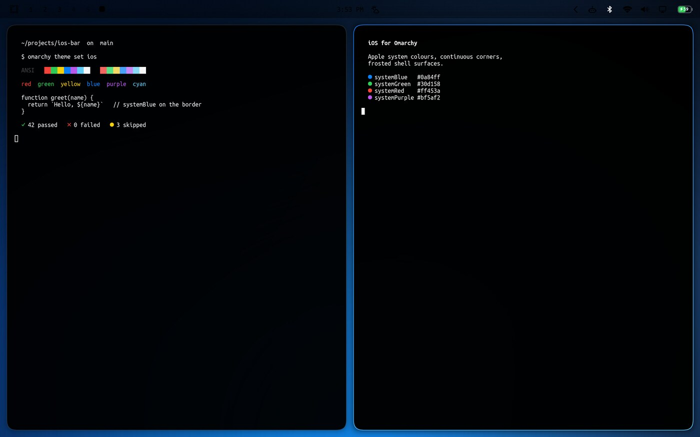
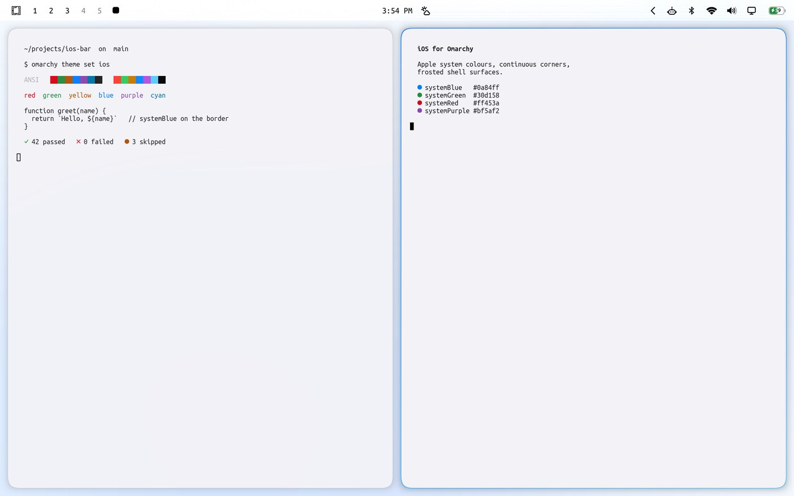
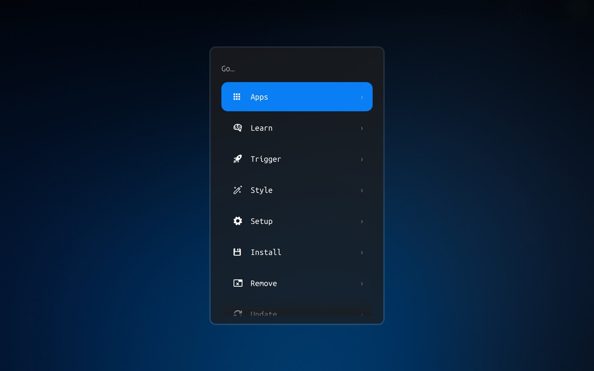

# iOS theme for Omarchy

Apple's system palette, continuous ("squircle") corners, hairline borders that light up in systemBlue,
frosted glass on the bar and menus, and iOS timing curves — for [Omarchy](https://omarchy.org) 4.

Two variants: **iOS** (dark) and **iOS Light**.

<p align="center"></p>

<p align="center"> </p>

## What it changes

| Surface | What you get |
|---|---|
| Windows | 14px continuous corners (`rounding_power 3.4`), 1px hairline border, systemBlue→systemCyan gradient when focused, soft shadow, iOS gaps |
| Bar, menus, notifications, OSD | Translucent and blurred — the frosted material iOS uses for Control Center |
| Selected rows | Solid systemBlue pill with white label, the way an iOS list selects |
| Terminal + apps | Apple's system colours: systemBlue `#0a84ff`, systemRed `#ff453a`, systemGreen `#30d158`, systemPurple `#bf5af2`… |
| Motion | Apple's curves: a soft standard ease, a gentle overshoot on appear, a quick exit; workspaces slide like Home Screen pages |
| Wallpapers | Four mesh gradients per variant, built from the same system colours |

Pairs with [omarchy-ios-bar](https://github.com/thediamondsaint/omarchy-ios-bar), which redraws the bar's
status icons (Wi-Fi fan, iPhone battery, speaker with waves) in the same style. The two are independent —
either works on its own.

## Install

```bash
git clone https://github.com/thediamondsaint/omarchy-ios-theme.git
cd omarchy-ios-theme
./install.sh            # installs both variants, switches to iOS (dark)
```

Then switch whenever you like:

```bash
omarchy theme set ios          # dark
omarchy theme set ios-light    # light
omarchy theme bg next          # next wallpaper
./uninstall.sh                 # back to your previous theme
```

**Why an installer instead of `omarchy theme install <url>`?** That command clones the repo into your
themes directory, and Omarchy refuses to load Lua from a theme that arrived as a clone — reasonable, since
a theme's `hyprland.lua` runs at login. But the window shape, the glass and the animations *are* that Lua.
`./install.sh` copies the files in instead, which makes them yours, so the whole theme applies. Installing
by URL works too; you just get the colours and the shell surfaces, and Omarchy prints what it dropped.

Requirements: Omarchy 4 (the Quickshell bar and Lua Hyprland config). Optional: ImageMagick, only to
regenerate wallpapers at your own resolution.

## Performance

The glass is the expensive part of an iOS look, so it is spent only where it shows:

- **Blur is on, but windows are excluded** (`no_blur` on every window). Only the shell's own layers — bar,
  menus, notifications, OSD, bar panels — are blurred, and those are small and rarely all on screen.
- **`xray = true`**: the blur samples the wallpaper rather than the windows behind it. That is both cheaper
  and truer to iOS, where the material is one consistent frost instead of a smear of whatever is open.
- **Two passes, radius 20.** In Hyprland the cost is in the passes, not the radius, so the radius is set
  where the material reads like iOS and the pass count stays low.
- **No `dim_inactive`, no full-screen effects, no shadow on layers.**

If you want it leaner still, edit `~/.config/omarchy/themes/ios/hyprland.lua`:

```lua
blur = { enabled = false },                                  -- flat, zero cost
hl.animation({ leaf = "workspaces", enabled = false })       -- instant workspace switching
```

…then `omarchy theme set ios` to re-apply. The same file is where `rounding`, `gaps_in/out` and
`border_size` live if you want tighter or airier windows.

## Making it yours

```
themes/ios/colors.toml     Apple's system colours; everything themed derives from this
themes/ios/hyprland.lua    corners, borders, shadow, blur, layer rules, animation curves
themes/ios/shell.toml      bar and flyout surfaces: translucency, iOS blue selection, spacing
themes/ios/backgrounds/    four generated mesh gradients
tools/make-wallpapers.sh   regenerate them at any resolution
```

- **Wallpapers at your resolution:** `./install.sh --wallpapers` (or `tools/make-wallpapers.sh 3840x2160`).
  They are built small, blurred, then scaled up, which is why they have no banding and stay ~100 KB.
- **A taller, airier bar:** in `shell.toml`, raise `[bar] size-horizontal` and `[font] base-size`.
- **Less glass:** raise `background-alpha` in `[bar]`, `[menu]`, `[popups]` toward 1.0.
- **Your own wallpaper:** `omarchy theme bg set ~/Pictures/whatever.jpg`. The blur has more to work with
  on a photo than on a gradient.

After editing anything in the installed theme, re-apply it: `omarchy theme set ios`.

## Troubleshooting

- **It looks half-applied — colours changed, but corners are square and nothing is frosted.** The theme
  was installed as a git clone, so Omarchy dropped its `hyprland.lua` (it says so on stderr). Remove it and
  run `./install.sh` from this repo instead.
- **The theme picker says "Ios".** Omarchy builds the display name by title-casing the folder name, so
  `ios` shows up as `Ios`. Cosmetic only; `omarchy theme set ios` is the command either way.
- **Windows have no shadow / blur does nothing.** Check `hyprctl configerrors`, then confirm the values
  landed: `hyprctl getoption decoration:rounding` should be 14 and `decoration:blur:size` 20. If they are
  not, the theme's Lua was not loaded — see the first point.
- **Blur is invisible.** With a smooth gradient wallpaper there is nothing to blur; it shows on photos.
- **A GTK app ignores the colours.** Omarchy themes GTK through its own templates; some apps need
  `omarchy restart` of that app, and a few (Electron) need their own theme.

## License

MIT, see [LICENSE](LICENSE). Apple's system colour *values* are facts about a published design system;
the name "iOS" is used descriptively to say what this looks like. Not affiliated with Apple.
