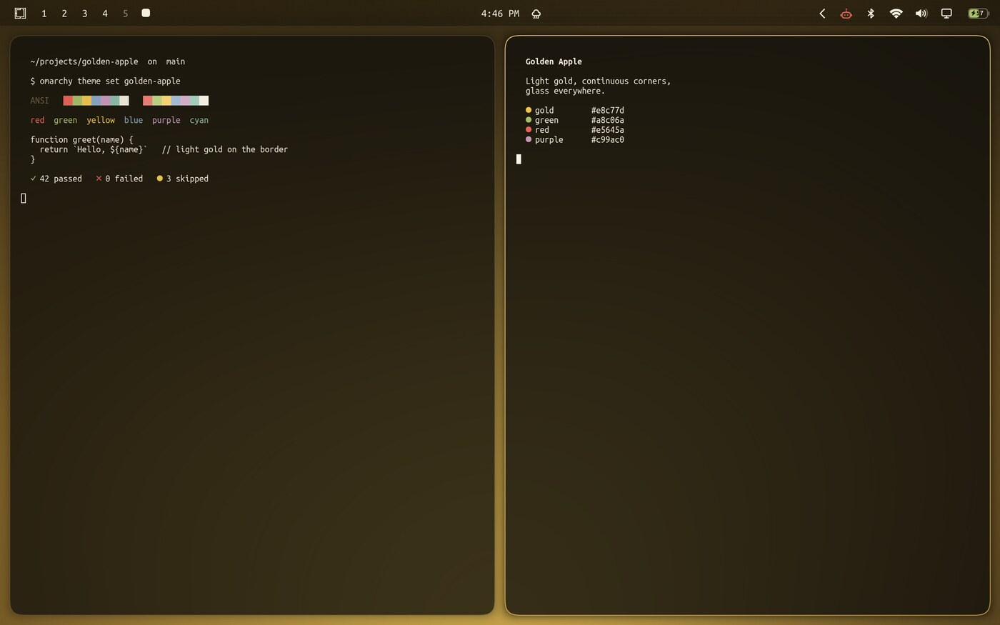
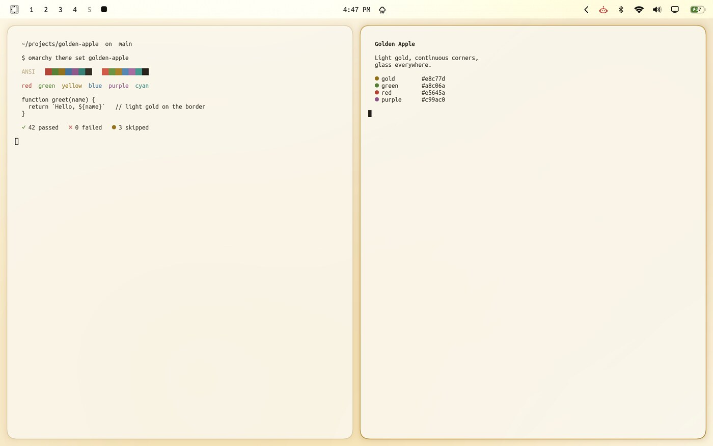
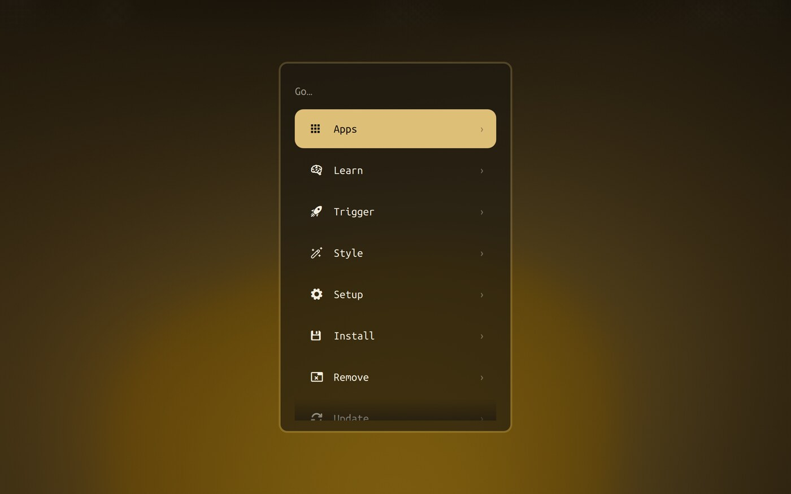

# Golden Apple — a gold glass theme for Omarchy

Light gold on warm black, continuous ("squircle") corners, and glass wherever a surface can be glass:
the bar, the menus, the notifications and the terminal itself. For [Omarchy](https://omarchy.org) 4.

Two variants: **Golden Apple** (dark) and **Golden Apple Light** (the same gold on warm paper).

<p align="center"></p>

<p align="center"> </p>

## What it changes

| Surface | What you get |
|---|---|
| Windows | 14px continuous corners (`rounding_power 3.4`), 1px hairline border, light-gold gradient when focused, soft shadow |
| Terminal | Actually transparent — `alpha` in `foot.ini`, so the background goes to glass and the **text stays fully opaque** |
| Bar, menus, notifications, OSD | Translucent, blurred, and tinted gold: `#1c1710` at 62% over a 20px blur |
| Bar icons | One colour — the theme's cream (gold when active), never black on some and white on others |
| Selected rows | A solid light-gold pill with dark text |
| Colours | Champagne gold `#e8c77d` carries the accent; the ANSI set leans warm so nothing reads cold beside it |
| Motion | Soft standard ease, a small overshoot on appear, a quick exit, Home Screen-style workspace slide |
| Wallpapers | A gold lion, plus four warm mesh gradients per variant — amber, ember, savanna, bronze (and champagne, honey, linen, parchment) |

Pairs with [omarchy-ios-bar](https://github.com/thediamondsaint/omarchy-ios-bar), which redraws the bar's
status icons as vector shapes that follow the theme's colours. The two are independent.

## Install

```bash
git clone https://github.com/thediamondsaint/omarchy-golden-apple.git
cd omarchy-golden-apple
./install.sh              # installs both variants, switches to Golden Apple (dark)
```

```bash
omarchy theme set golden-apple         # dark
omarchy theme set golden-apple-light   # light
omarchy theme bg next                  # next wallpaper
./uninstall.sh                         # back to your previous theme
```

**Why an installer instead of `omarchy theme install <url>`?** That command clones the repo into your
themes directory, and Omarchy refuses to load Lua or a terminal config from a theme that arrived as a
clone — reasonable, since both run code. But the corners, the glass, the motion and the terminal's
transparency *are* those files. `./install.sh` copies them in instead, which makes them yours.

Installing by URL still works and is not broken — the dark variant's files sit at the root of this repo
for exactly that reason — you simply get the colours, the wallpapers and the translucent shell without
the corners, the blur, the motion or the see-through terminal. Running `./install.sh` afterwards replaces
that clone with the real thing.

Requirements: Omarchy 4. Optional: ImageMagick, only to regenerate wallpapers at your own resolution.

## Wallpapers

Both variants ship with a gold lion (`0-lion.jpg`, 2560×1600) first in the rotation, followed by the
generated gradients. `omarchy theme bg next` cycles.

## Your own wallpaper

```bash
tools/add-wallpaper.sh ~/Pictures/lion.jpg                       # dark variant
tools/add-wallpaper.sh ~/Pictures/lion.jpg golden-apple-light    # light variant
tools/add-wallpaper.sh ~/Pictures/lion.jpg --repo                # ship it with the theme
```

It lands in `~/.config/omarchy/backgrounds/golden-apple/`, which is Omarchy's place for wallpapers you
add yourself: it survives re-running `./install.sh` and joins the rotation in `omarchy theme bg next`.
A photograph is where the glass earns its keep — a blur needs something to work with, which a flat
gradient never gives it.

## Performance

Glass is the expensive part, so it is spent where it shows:

- **`xray = true`** — the blur samples the wallpaper rather than the stack of windows under it. One
  consistent material instead of a smear, and the cost is the same with one window open or twenty.
- **Two passes, radius 20.** In Hyprland the cost is in the passes, not the radius, so the radius goes
  where the material reads right and the pass count stays low.
- **The terminal's transparency is free** — it is the app drawing its own background, not an effect.
- No `dim_inactive`, no layer shadows, no full-screen effects.

Leaner, in `~/.config/omarchy/themes/golden-apple/hyprland.lua`:

```lua
blur = { enabled = false },                               -- flat, zero cost
hl.animation({ leaf = "workspaces", enabled = false })    -- instant workspace switching
```

…and `alpha=1.0` in the same folder's `foot.ini` for a solid terminal. Re-apply with
`omarchy theme set golden-apple`.

## Making it yours

```
colors.toml                the palette everything else derives from
hyprland.lua               corners, borders, shadow, blur, layer rules, animation curves
shell.toml                 bar and flyout surfaces: gold tint, translucency, selection
foot.ini                   terminal colours + the alpha that makes it glass
backgrounds/               four generated mesh gradients
themes/golden-apple-light/ the same five files for the light variant
tools/make-wallpapers.sh   regenerate the wallpapers at any resolution
tools/add-wallpaper.sh     drop your own image in and switch to it
```

- **More or less gold in the glass:** `background` and `background-alpha` in `shell.toml`'s `[menu]`,
  `[popups]`, `[bar]`. The tint is the surface colour, not the blur.
- **A more solid terminal:** raise `alpha` in `foot.ini` (0.82 dark / 0.90 light by default).
- **Wallpapers at your resolution:** `./install.sh --wallpapers`, or `tools/make-wallpapers.sh 3840x2160`.
- **A taller, airier bar:** `[bar] size-horizontal` and `[font] base-size` in `shell.toml`.

After editing anything in the installed theme, re-apply it: `omarchy theme set golden-apple`.

## Troubleshooting

- **It looks half-applied — colours changed, but corners are square and nothing is frosted.** The theme
  was installed as a git clone, so Omarchy dropped its Lua and `foot.ini` (it says so on stderr). Run
  `./install.sh` from this repo instead.
- **Windows are translucent but what shows through is sharp, not blurred.** Hyprland keeps window rules
  a theme registered even across `hyprctl reload`, so if you previously ran a theme that set `no_blur`
  on windows, that rule stays until Hyprland restarts — log out and back in once. The shell's own
  surfaces (bar, menus) blur immediately either way.
- **Some bar icons are black, some cream.** The bar was in "transparent" mode, where Omarchy picks black
  or cream text from the wallpaper under the bar and only some widgets follow it. `./install.sh` turns
  that off (`omarchy bar transparent false`) so the bar is the theme's tinted glass with theme-coloured
  icons; `./uninstall.sh` turns it back on if it was on.
- **An app is opaque.** Only apps that draw a transparent background can be glass. The terminal does it
  through `foot.ini`; Electron and most GTK apps cannot, and a Hyprland `opacity` rule fades their text
  along with the background, which is why this theme keeps that rule gentle.
- **Blur is invisible.** With a flat gradient wallpaper there is nothing to blur. Try a photograph.
- **The picker shows "Golden Apple" but `omarchy theme set Golden Apple` fails.** Use the folder name:
  `omarchy theme set golden-apple`.

## License

MIT, see [LICENSE](LICENSE). Not affiliated with Apple; "Golden Apple" is a name, not a claim.
